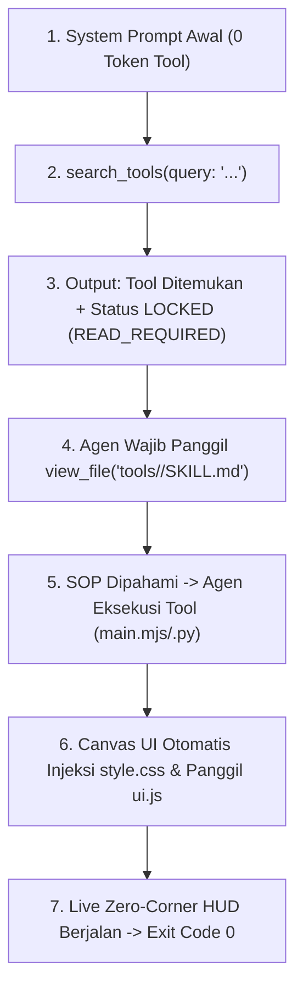

# 🛠️ PANDUAN STANDARISASI & PEMBUATAN DYNAMIC TOOLS FLOWORK OS

> **OTORITAS**: FLOWORK SOVEREIGN CORE  
> **DOKTRIN**: 1 FOLDER 1 TOOL UTUH | STRICT ZERO-CORNER HUD | MANDATORY LAZY SKILL LOCK | 0-TOKEN PROMPT BLOAT  
> **TARGET DIREKTORI**: `tools/<nama_tool>/`

---

## 1. DOKTRIN & FILOSOFI ARSITEKTUR

Setiap tool baru di Flowork OS wajib menganut prinsip **Self-Contained Autonomous Pod**. Developer atau agen tidak boleh memecah file tool ke direktori global yang berbeda atau mengedit kode inti `canvas.js`.

### 5 Pilar Wajib 1 Folder Tool (`tools/<nama_tool>/`)
```text
FLOWORK/
└── tools/
    └── <nama_tool>/
        ├── manifest.json   # [WAJIB] Identitas, parameter, & deklarasi UI
        ├── SKILL.md        # [WAJIB] SOP cara pakai (Wajib 20 English Keywords)
        ├── main.mjs / .py  # [WAJIB] Engine eksekusi (Multi-OS, Exit Code 0)
        ├── style.css       # [WAJIB] Styling Strict Zero-Corner (Tanpa Sudut Siku)
        └── ui.js           # [WAJIB] Dynamic Controller (mountLive, onStream, onDone)
```

---

## 2. MEKANISME "LAZY DISCOVERY & MANDATORY SKILL LOCK"

Untuk mencegah pembengkakan token (*Context Window Bloat*), Flowork OS melarang memuat daftar tool atau isi SOP ke System Prompt sejak awal.



1. **0 Token di Awal**: Prompt obrolan awal bersih dari seluruh dynamic tools.
2. **Pencarian On-Demand (`search_tools`)**: Agen mencari kemampuan yang dibutuhkan. Mesin memindai `manifest.json` dan 20 kata kunci pada `SKILL.md`.
3. **Status Terkunci (`LOCKED`)**: Output `search_tools` mengembalikan direktif wajib:
   `[MANDATORY SOP] You MUST inspect 'tools/<id>/SKILL.md' via view_file before invoking this tool!`
4. **Verifikasi Gembok**: Tool tidak boleh dieksekusi sebelum agen membaca file `SKILL.md` tersebut di sesinya.

---

## 3. SPESIFIKASI BERKAS 1 PER 1

### A. Kontrak `manifest.json`
Berkas deklarasi utama yang dibaca oleh runtime engine:
```json
{
  "name": "nama_tool",
  "category": "utility | finance | devops | security | media | ai",
  "description": "Deskripsi singkat mengenai fungsi dan kapabilitas tool.",
  "command": "node tools/nama_tool/main.mjs",
  "entry": "main.mjs",
  "author": "Nama Developer / Flowork Agent",
  "version": "1.0.0",
  "tags": [
    "keyword1",
    "keyword2",
    "kategori"
  ],
  "ui": {
    "css": "style.css",
    "entry": "ui.js",
    "zero_corner": true,
    "theme": "holographic_cyan"
  },
  "parameters": {
    "param_satu": {
      "type": "string",
      "description": "Penjelasan kegunaan parameter",
      "default": "nilai_default"
    },
    "opsional_angka": {
      "type": "number",
      "description": "Batas limit atau angka operasional",
      "default": 10
    }
  }
}
```

---

### B. Kontrak `SKILL.md` (Aturan Besi 20 Keywords)
`SKILL.md` adalah Runbook resmi agen. Tanpa berkas ini, tool ditandai `INVALID_MISSING_SKILL` dan diblokir dari runtime.

> [!IMPORTANT]
> **STANDAR FRONTMATTER:**
> Bagian `keywords:` **WAJIB TEPAT BERISI 20 KATA KUNCI BAHASA INGGRIS**. Kurang atau lebih dari 20 kata kunci dianggap cacat doktrin!

**Template Baku `SKILL.md`:**
```markdown
---
name: nama-tool
description: Standard Operating Procedure for executing and parameterizing nama_tool.
keywords:
  - keyword_one
  - keyword_two
  - keyword_three
  - keyword_four
  - keyword_five
  - keyword_six
  - keyword_seven
  - keyword_eight
  - keyword_nine
  - keyword_ten
  - keyword_eleven
  - keyword_twelve
  - keyword_thirteen
  - keyword_fourteen
  - keyword_fifteen
  - keyword_sixteen
  - keyword_seventeen
  - keyword_eighteen
  - keyword_nineteen
  - keyword_twenty
---

# 🛠️ NAMA TOOL — OPERATIONAL RUNBOOK (SOP)

## 1. PURPOSE & CAPABILITY
Jelaskan tujuan spesifik tool dan kapabilitas analisisnya.

## 2. PARAMETERS & INPUT SCHEMA
| Parameter | Type | Required | Default | Description |
| :--- | :--- | :--- | :--- | :--- |
| `param_satu` | string | Yes | `"default"` | Penjelasan parameter |

## 3. EXECUTION COMMANDS
```bash
node tools/nama_tool/main.mjs --params '{"param_satu":"value"}'
```

## 4. RETURN SCHEMA
Jelaskan format output JSON berstandar Exit Code 0.
```

---

### C. Kontrak GUI: Strict Zero-Corner `style.css`
Sesuai Doktrin Desain Flowork OS: **DILARANG MENGGUNAKAN SUDUT SIKU (HARAM KOTAK / 90° CORNER)**.

#### Aturan Baku Radius:
* **Wadah Luar (Pod Dome)**: `border-radius: 26px` s/d `34px`.
* **Orb / Radar Berputar**: `border-radius: 50%` (lingkaran penuh).
* **Badge, Pill Status, & Progress Track**: `border-radius: 999px` (stadium pill).
* **Nilai Larangan**: `border-radius: 0`, `2px`, `4px`, `8px` (kategori siku/kotak dilarang).

**Template Baku `style.css`:**
```css
/* Container Utama: Holographic Acrylic Dome */
.fl-nama_tool-pod {
  position: relative;
  margin: 12px 0;
  padding: 18px 22px;
  background: radial-gradient(130% 120% at 50% 0%, rgba(6, 182, 212, 0.12) 0%, rgba(3, 7, 18, 0.8) 100%);
  border: 1px solid rgba(6, 182, 212, 0.35);
  border-radius: 34px;
  backdrop-filter: blur(16px) saturate(180%);
  box-shadow: 0 10px 30px -10px rgba(6, 182, 212, 0.25), inset 0 1px 0 rgba(255, 255, 255, 0.12);
  color: #f1f5f9;
  overflow: hidden;
  transition: all 0.35s cubic-bezier(0.16, 1, 0.3, 1);
}

/* 50% Orb Berputar */
.fl-nama_tool-orb {
  width: 32px;
  height: 32px;
  border-radius: 50%;
  background: conic-gradient(from 0deg, #06b6d4, #3b82f6, #10b981, #06b6d4);
  animation: fl-tool-spin 3s linear infinite;
}

/* 999px Stadium Pill */
.fl-nama_tool-pill {
  display: inline-flex;
  align-items: center;
  padding: 5px 14px;
  background: rgba(255, 255, 255, 0.06);
  border: 1px solid rgba(255, 255, 255, 0.12);
  border-radius: 999px;
  font-size: 11px;
}

/* 999px Progress Track */
.fl-nama_tool-meter-track {
  height: 6px;
  background: rgba(255, 255, 255, 0.08);
  border-radius: 999px;
  overflow: hidden;
}

.fl-nama_tool-meter-fill {
  height: 100%;
  border-radius: 999px;
  background: linear-gradient(90deg, #06b6d4, #10b981);
}

@keyframes fl-tool-spin {
  from { transform: rotate(0deg); }
  to { transform: rotate(360deg); }
}
```

---

### D. Kontrak Interaktivitas `ui.js`
`ui.js` adalah ES Module yang diexport secara dinamis oleh Canvas UI untuk menangani siklus hidup HUD animasi di chat:

```javascript
/**
 * Dynamic Tool UI Controller
 */
export default {
  /**
   * 1. Dipanggil saat tool mulai berjalan (masuk ke .fl-live-active-slot)
   */
  mountLive(slotEl, details = {}, stepIdx = '') {
    if (!slotEl) return null;
    const pod = document.createElement('div');
    pod.className = 'fl-nama_tool-pod';
    pod.setAttribute('data-live-step', String(stepIdx));
    pod._spawnTime = Date.now();

    pod.innerHTML = `
      <div class="fl-nama_tool-header">
        <div class="fl-nama_tool-orb"></div>
        <span class="fl-nama_tool-label">TOOL NAME</span>
        <span class="fl-nama_tool-pill">EXECUTING...</span>
      </div>
      <div class="fl-nama_tool-meter-track">
        <div class="fl-nama_tool-meter-fill" style="width: 25%;"></div>
      </div>
    `;

    slotEl.appendChild(pod);
    return pod;
  },

  /**
   * 2. Dipanggil setiap ada chunk stream stdout/stderr dari backend
   */
  onStream(slotEl, chunkData) {
    if (!slotEl) return;
    const pod = slotEl.querySelector('.fl-nama_tool-pod');
    if (!pod) return;
    // Update live text/progress di dalam pod
  },

  /**
   * 3. Dipanggil saat tool selesai dieksekusi (tool_done / Exit Code 0)
   */
  onDone(slotEl, outputData) {
    if (!slotEl) return;
    const pod = slotEl.querySelector('.fl-nama_tool-pod');
    if (!pod) return;
    const pill = pod.querySelector('.fl-nama_tool-pill');
    if (pill) pill.textContent = '✓ COMPLETED (EXIT 0)';
    const fill = pod.querySelector('.fl-nama_tool-meter-fill');
    if (fill) fill.style.width = '100%';
  }
};
```

---

### E. Kontrak Eksekusi `main.mjs` / `main.py`
* **Multi-OS Safe**: Hindari hardcoded path `/` atau `\`. Gunakan path resolver runtime.
* **Exit Code Disiplin**: Wajib `process.exit(0)` / `sys.exit(0)` jika sukses. Kembalikan kode > 0 jika ada error nyata.
* **JSON Output**: Kembalikan stdout berformat JSON terstruktur agar mudah diparse oleh agen dan `ui.onDone`.

---

## 4. CHECKLIST QUALITY CONTROL (QC) SEBELUM PUBLIKASI

Sebelum sebuah tool dinyatakan valid dan siap dipakai:
- [ ] Folder diletakkan di `tools/<nama_tool>/`.
- [ ] Berkas `manifest.json` valid JSON dan memuat deklarasi `ui`.
- [ ] Berkas `SKILL.md` memiliki frontmatter YAML dengan **TEPAT 20 KATA KUNCI BAHASA INGGRIS**.
- [ ] `style.css` 100% Zero-Corner (audit: tidak ada `border-radius: 0px` atau siku kotak).
- [ ] `ui.js` meng-export `mountLive`, `onStream`, dan `onDone`.
- [ ] Mesin eksekusi berhasil dijalankan langsung di terminal dengan **Exit Code 0**.
- [ ] Perintah `node connection/search_tools.js "<nama_tool>"` berhasil menemukan tool dan memunculkan status `LOCKED (READ_REQUIRED)`.
